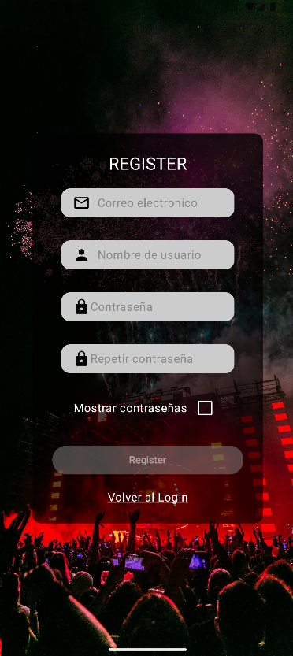
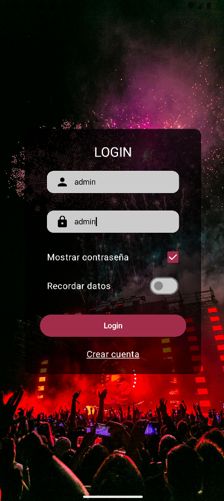
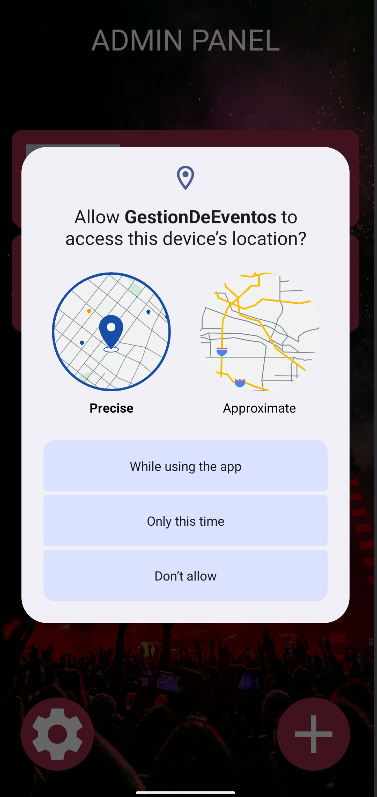
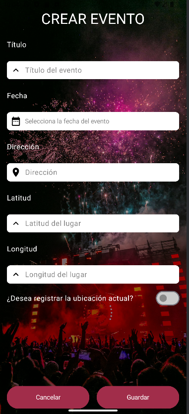
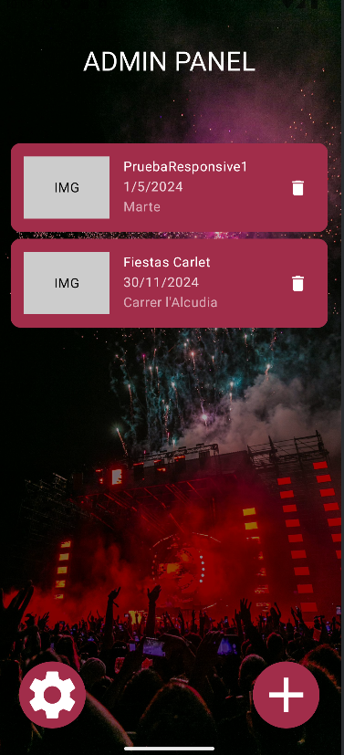
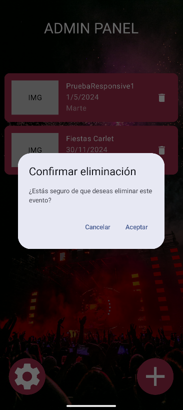
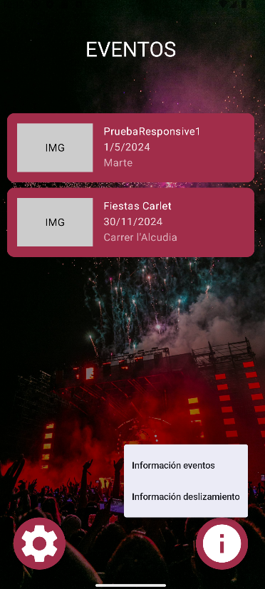
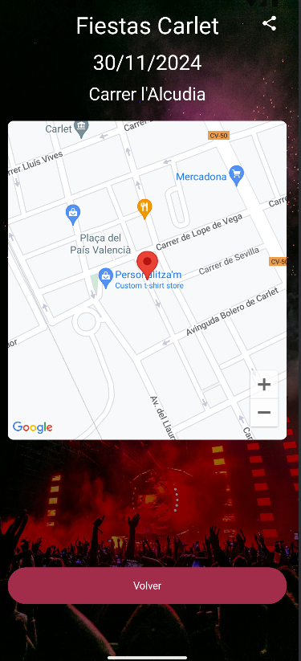
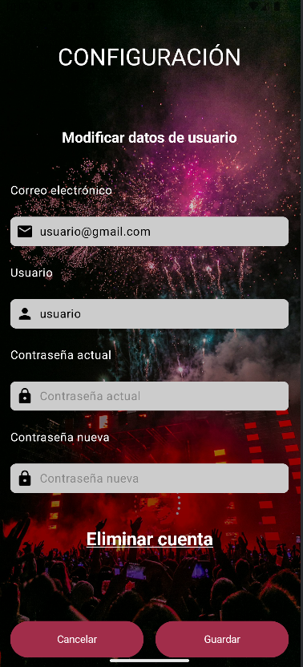
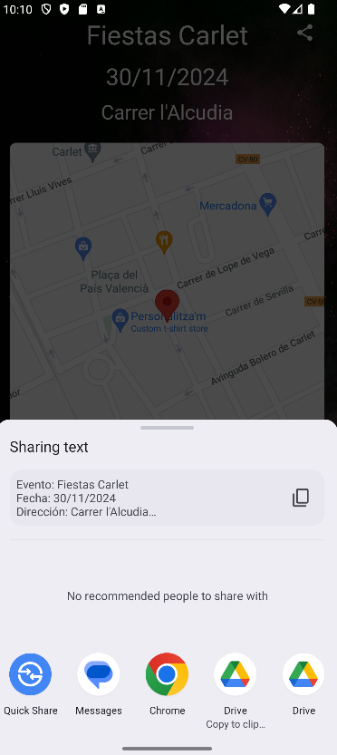

# Gestión de Eventos

**Gestión de Eventos** es una aplicación diseñada para facilitar la organización y administración de eventos, permitiendo a los usuarios crear, editar y gestionar eventos de manera eficiente.

## Características

- Creación de eventos con detalles como fecha, ubicación y descripción.
- Interfaz de usuario intuitiva y fácil de usar.
- Registro e inicio de sesión.
- Filtro de eventos por fecha.
- Pop-ups informativos para entender las funcionalidades de la app.
- Uso del sensor de ubicación para determinar la posición actual del usuario.
- Posibilidad de compartir eventos.

## Tecnologías Utilizadas

- **Lenguaje de programación:** Kotlin
- **Toolkit:** Jetpack Compose
- **Base de datos:** SQLDelight
- **APIs:** Google Maps API
- **Sensores:** Sensor de ubicación del dispositivo

## Instalación

1. **Clona este repositorio en tu máquina local:**

   ```bash
   git clone https://github.com/jbotgil/GestionDeEventos.git
   ```

2. **Navega al directorio del proyecto:**

   ```bash
   cd GestionDeEventos
   ```

3. **Instala las dependencias necesarias:**  
   Abre el proyecto en Android Studio para que automáticamente resuelva las dependencias configuradas en el archivo `build.gradle`.

4. **Ejecuta la aplicación:**  
   Conecta un dispositivo Android o usa un emulador en Android Studio y ejecuta el proyecto.

## Uso

1. **Registro e inicio de sesión:**  
   Los usuarios deben registrarse para acceder a la funcionalidad completa de la aplicación.  
   
   


   Para una experiencia completa, puedes usar un usuario **administrador** predefinido:  

   ```plaintext
   Usuario: admin  
   Contraseña: admin
   ```
   


2. **Gestión de eventos:**  

   - **Usuarios administradores:**  
     - Solicita permiso de ubicación.
     - Crear nuevos eventos con toda la información requerida.  
     - Visualizar una lista de eventos existentes.  
     - Eliminar eventos según sea necesario.  
     
   <div style="display: flex; justify-content: space-around;">
      
      
      
      
   </div>

   - **Usuarios normales:**  
     - Visualizar una lista de eventos existentes.  
     - Ver los detalles de cada evento.  
     - Acceder a una configuración de cuenta para cambiar el usuario o la contraseña.  
     - Compartir eventos.
   <div style="display: flex; justify-content: space-around;">
      
      
      
      
   </div>

## Contribución

¡Las contribuciones son bienvenidas! Para contribuir:  

1. Haz un fork de este repositorio.  
2. Crea una nueva rama para tu característica o corrección de errores.  
3. Envía un pull request detallando los cambios realizados.  

## Próximos Pasos

- Implementación de notificaciones push para recordar a los usuarios sus eventos.  
- Implementación de una barra de búsqueda para filtrar eventos por nombre.  
- Implementación de búsquedas por código postal para localizar eventos en una zona específica.  

---

Si tienes alguna duda o sugerencia, no dudes en abrir un issue en el repositorio. ¡Gracias por tu interés en este proyecto!